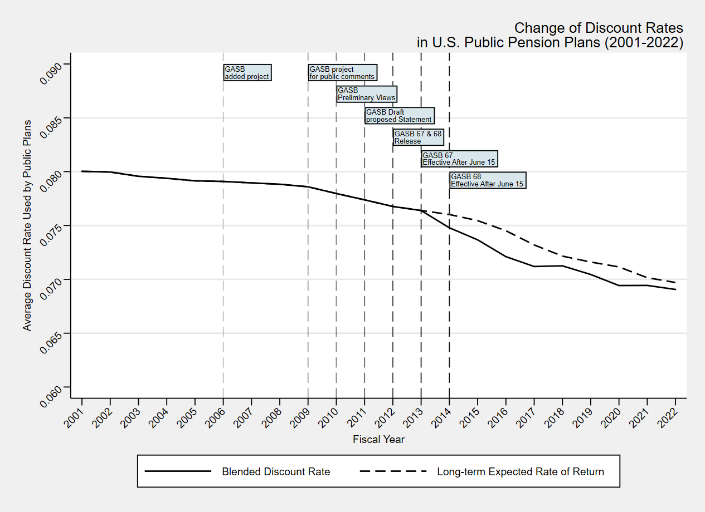
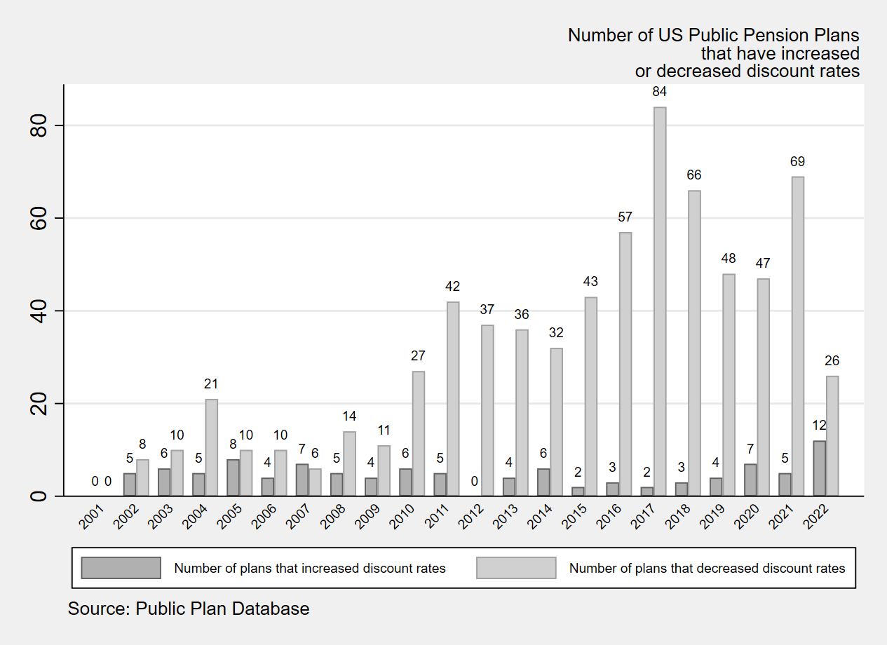
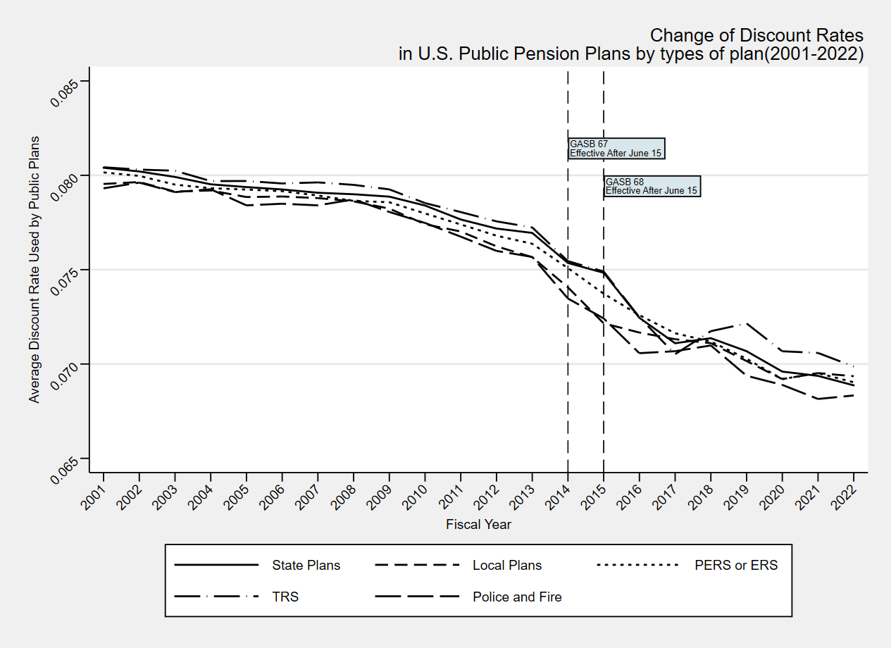

# Background: Fiscal Transparency and Public Pensions

-   Disclosure of government financial information is vital to public sector accountability.

-   Accounting and financial reporting standards aim to enhance accuracy, reliability, comprehensiveness, and comparability of financial data.

-   Concerns around public plans not providing sufficient information on pension costs and liabilities, leading to a lack of transparency and comparability in public pension reporting.

-   Concerns around “opportunistic” behavior of public pension plans to hide the actual liabilities and lower the costs.

-   There exists a gap in the literature on how accounting and financial reporting standards affect fiscal transparency in public pension management.

# GASB 67 and 68

-   The Governmental Accounting Standards Board (GASB) sets accounting and financial reporting standards for U.S. state and local governments.

-   Statements 67 and 68 introduce new standards for measuring and recognizing net pension liabilities.

    -   GASB 67: Provides guidelines for pension plan reporting, effective after June 15, 2013.
    -   GASB 68: Focuses on pension obligations for government employers, effective after June 15, 2014.

-   Blended Discount Rate

    -   Long-term expected rate of return on plan investments to the extent that current and expected future plan net assets are projected to be sufficient to make benefit payments; and
    -   A high-quality municipal bond index rate beyond the point at which plan net assets are projected to be fully depleted.

# Timeline of GASB Standards

-   **2010**: On June 16, 2010, the Governmental Accounting Standing Boards (GASB) published a preliminary view on the issues related to Pension Accounting and Financial Reporting by Employers and request public comments by September 17, 2010.
-   **2012**: In June 2012, GASB issued Statements 67 and 68 to provide updated guidelines for pension systems (Statement 67) and government employers (Statement 68) to improve pension accounting and financial reporting
-   **2013**: GASB 67 takes effect for fiscal years beginning after June 15, 2013
-   **2014**: GASB 68 takes effect for fiscal years beginning after June 15, 2014

# Theoretical Framework: Public Choice and Fiscal Illusion

-   Politicians/bureaucrats are motivated by self interests to maximize their budgets.

-   Information asymmetry leads to agency problems and fiscal illusion.

-   Fiscal illusion: Government officials create an illusion for voters that the actual cost of public services is lower than it truly is.
    -   Examples: revenue complexity, revenue elasticity, debt financing, renter illusion, intergovernmental transfers, and indirect taxes (Oates 1988; Wagner 1976; Afonso 2014).
    -   Unfunded pension liabilities serve as a form of fiscal illusion.

# Literature review on major viewpoints on GASB 67 and 68

-   Some anticipated outcomes of the new standards, such as a downward trend in discount rates and an increase in reported net liabilities (Aubry et al., 2017; Mortimer & Henderson, 2014; Weinberg & Norcross, 2017)
-   Some studies identified impacts of GASB 68 in making government financial reporting more transparent by increasing awareness of the financial costs of pension obligations (Dambra et al., 2023; Weinberg & Norcross, 2017).
-   Some concerns on the effectiveness of new standards in creating a universal accounting methods and assumptions for pension reporting (Allen & Petacchi, 2023; Schrager, 2024; Thornburg & Rosacker, 2018)
-   Studies found that pension plans and the government sponsoring those plans might adjust their funding policies or investment strategies following the introduction of GASB 67/68 (Allen & Petacchi, 2023; Mortimer & Henderson, 2014; Stalebrink & Donatella, 2021)

# Research setting

GASB as a Transparency Tool

-   GASB 67/68 serve to reduce information asymmetry, generate information that is accurate, reliable, comprehensive, and comparable, and expose the hidden costs of public services
-   They help resolve:
    -   Agency problems via better information quality
    -   Fiscal illusion by revealing the true cost of pension funding

Two Scenarios:

1.  Prudent Plans Already used conservative discount rates
    -   Little change after GASB 67/68; low fiscal illusion; low agency cost
2.  Opportunistic Plans Used high discount rates to inflate funded ratios
    -   Face pressure post-GASB to disclose true liabilities
    -   Experience: increase in liabilities; decrease in funded ratios; and changes in financial management decisions

# Hypotheses

-   Hypothesis 1: After the implementation of GASB 67 and 68, **discount rates** among public pension plans tend to decrease, and the decreasing trends of discount rates are most observable among plans with lower funded ratios. (financial reporting)

-   Hypothesis 2: After the implementation of GASB 67 and 68, **liabilities** of public pension plans tend to increase, and their **funded ratios** tend to decrease. (financial reporting)

-   Hypothesis 3: After the implementation of GASB 67 and 68, public pension plans tend to increase their **contributions** while decreasing pension **benefits**. (financial management)

------------------------------------------------------------------------

# Data and Sample

We use 210 state and local pension plans in Public Plan Database (PPD) from 2009 to 2019 for our regression analysis to understand the extent to which public pension plans changes their financial reporting and financial management decisions.

\begin{table}[h!]
\centering
\resizebox{\textwidth}{!}{%
\begin{tabular}{|l|c|c|c|c|c|}
\hline
\textbf{Administor} & \textbf{Single} & \textbf{Agent} & \textbf{Cost-sharing} & \textbf{Total} & \textbf{Percentage (\%)} \\ \hline
State               & 7               & 17            & 94                     & 118            & 56.19                    \\ \hline
County              & 9               & 0             & 8                      & 17             & 8.09                     \\ \hline
City                & 63              & 0             & 5                      & 68             & 32.38                    \\ \hline
School              & 3               & 0             & 4                      & 7              & 3.33                     \\ \hline
\textbf{Total}      & \textbf{83}     & \textbf{17}   & \textbf{110}           & \textbf{210}   & \textbf{100}             \\ \hline
\end{tabular}%
}
\caption{Distribution of Public Pension Plans by Administrator Type}
\end{table}

# Change of Blended Discount Rates

```{=latex}
\centering
\includegraphics[width=0.85\linewidth]{graph_change.png}
```

<!-- {width="90%"} -->

# Plans that have changed the discount rates

```{=latex}
\centering
\includegraphics[width=0.9\linewidth]{graph_plans.png}
```

<!-- {width="90%"} -->

# Change of Discount Rate by Types of Plan

```{=latex}
\centering
\includegraphics[width=0.9\linewidth]{change_by_employer.png}
```

<!-- {width="90%"} -->

# Regression Equations

\begin{align*}
Y_{st} =\ & \beta_0 + \beta_1 \cdot \text{PostGASB67}_t + \beta_2 \cdot \text{PostGASB67}_{t+1} \\
         & + \beta_3 \cdot \text{PostGASB67}_{t+2} + \text{Controls} + \nu_s + \mu_t + \epsilon_{st}
\end{align*}

-   Financial information (Y): Blended Discount Rate (BDR); Reported Liability; Reported Funded Ratio

-   Financial management (Y): Rate of Return Assumption; Employer Contribution Rate; Normal Cost Rate; % of Required Contribution Paid

-   Control Variables: amortization period, asset smoothing period, 5-year average investment return, retiree to worker ratio, open or closed amortization method, total membership (log), Social Security coverage (yes or no), open or closed plan, employment types (teachers, police and firefighter, or general public employees)

# Variable Definitions

\begin{table}[h!]
\centering
\resizebox{\textwidth}{!}{%
\begin{tabular}{|l|p{12.5cm}|}
\hline
Variable & Definition \\
\hline
Post GASB 67 & One year after the implementation of GASB 67 (Fiscal Year 2014 and after) \\
Post GASB 67 (t+1) & Two years after the implementation of GASB 67 (Fiscal Year 2015 and after) \\
Post GASB 67 (t+2) & Three years after the implementation of GASB 67 (Fiscal Year 2016 and after) \\
Reported Discount Rate (\%) & Blended discount rate × 100 \\
Reported Liability (\%) & Total pension liability (TPL) / payroll × 100 \\
Reported Funded Ratio (\%) & Funded ratio based on total pension liability (TPL) \\
Employer Normal Cost Rate (\%) & Total employer normal cost / payroll × 100 \\
Required Contribution Paid (\%) & Actual contributions / actuarially determined contributions × 100 \\
5-year Return Rate (\%) & Average of 5-year investment returns \\
Retiree-to-worker ratio & Total beneficiaries / total active members \\
Amortization Period & Remaining amortization period for unfunded liabilities (years) \\
Asset Smoothing Period & Asset smoothing period (years) \\
Closed Amortization & Closed amortization funding method (Yes = 1; No = 0) \\
Membership (log) & Log of total number of members \\
Social Security Coverage & Plan members are covered by Social Security (Yes = 1; No = 0) \\
Closed Plans & Plans are closed to new members (Yes = 1; No = 0) \\
Teachers' Retirement Plans & Whether the plan is a Teachers’ Retirement System (Yes = 1; No = 0) \\
Police and Fire Plans & Whether the plan is a Public Safety Plan (Yes = 1; No = 0) \\
Single Employer Plans & Whether the plan is a single employer plan (Yes = 1; No = 0) \\
\hline
\end{tabular}
}
\end{table}

# Results - Effect of GASB 67 on Financial Information Disclosure

\begin{table}[h!]
\centering
\footnotesize
\begin{tabular}{lccc}
\hline
\textbf{VARIABLES} &
\begin{tabular}{@{}c@{}}(1) Blended\\ Discount Rate (\%)\end{tabular} &
\begin{tabular}{@{}c@{}}(2) Reported\\ Liability (\%)\end{tabular} &
\begin{tabular}{@{}c@{}}(3) Reported\\ Funded Ratio (\%)\end{tabular} \\
\hline
Post GASB 67        & -0.21*** & 0.37**  & -0.92     \\
                    & (0.08)   & (0.15)  & (1.00)    \\
Post GASB 67 (t+1)  & -0.14*** & 0.18*** & -1.06***  \\
                    & (0.04)   & (0.06)  & (0.38)    \\
Post GASB 67 (t+2)  & -0.27*** & 0.34*** & -2.46***  \\
                    & (0.06)   & (0.10)  & (0.78)    \\
Controls            & Yes      & Yes     & Yes       \\
Plan fixed effects  & Yes      & Yes     & Yes       \\
Year fixed effects  & Yes      & Yes     & Yes       \\
Observations        & 1,732    & 1,720   & 1,732     \\
R-squared           & 0.262    & 0.708   & 0.142     \\
\hline
\end{tabular}

\begin{flushleft}
\footnotesize
\end{flushleft}
\end{table}

# Results - Impact of GASB Standards on Financial Management Decisions

\begin{table}[h!]
\centering
\footnotesize
\begin{tabular}{lcccc}
\hline
\textbf{VARIABLES} &
\begin{tabular}{@{}c@{}}(1) Employer\\ Contribution\\ Rate (\%)\end{tabular} &
\begin{tabular}{@{}c@{}}(2) Employer\\ Normal Cost\\ Rate (\%)\end{tabular} &
\begin{tabular}{@{}c@{}}(3) Required\\ Contribution\\ Paid (\%)\end{tabular} \\
\hline
GASB 67 (t)         & 0.57     & 0.33     & 0.04**  \\
                    & (0.62)   & (0.25)   & (0.01)  \\
Post GASB 67 (t+1)  & 1.52**   & 0.24     & 0.06*** \\
                    & (0.78)   & (0.18)   & (0.01)  \\
Post GASB 67 (t+2)  & 0.91     & -0.04    & 0.07*** \\
                    & (0.60)   & (0.14)   & (0.02)  \\
Controls            & Yes      & Yes      & Yes     \\
Plan fixed effects  & Yes      & Yes      & Yes     \\
Year fixed effects  & Yes      & Yes      & Yes     \\
Observations        & 1,849    & 1,808    & 1,782   \\
R-squared           & 0.362    & 0.316    & 0.130   \\
\hline
\end{tabular}

\begin{flushleft}
\footnotesize
\end{flushleft}
\end{table}

# Regression results for discount rate by different scenarios

```{=latex}
\centering
\includegraphics[width=0.9\linewidth]{event_study_report_discount_100_fund_status_PMRC_figure1.png}
```

<!-- {width="90%"} -->

# Regression results for liability by different plans

```{=latex}
\centering
\includegraphics[width=0.9\linewidth]{event_study_liability_by_funding_PMRC_graph2.png}
```

<!-- {width="90%"} -->

# Regression results for employer contributions by different plans

```{=latex}
\centering
\includegraphics[width=0.85\linewidth]{event_study_ERC_by_funding_PMRC_graph3.png}
```

<!-- {width="90%"}  -->

# Regression results for normal cost rates by different plans

```{=latex}
\centering
\includegraphics[width=0.9\linewidth]{event_study_NC_by_funding_PMRC_graph4.png}
```

<!-- {width="90%"}  -->

# Regression results for ADC paid by different plans

```{=latex}
\centering
\includegraphics[width=0.9\linewidth]{event_study_ADCpaid_by_funding_PMRC_graph5.png}
```

# Predicted employer contribution rates by funding level

```{=latex}
\centering
\includegraphics[width=0.9\linewidth]{predicted_ERC_graph6.png}
```

<!-- {width="90%"} -->

# Conclusion

-   Discount Rates Decreased: Following the implementation of GASB 67 & 68, public pension plans, especially those with low funded ratios, significantly lowered their discount rates.

-   Liabilities Increased: As a result of discount rate change, pension liabilities increased, reflecting more conservative valuation standards under the new GASB rules.

-   Funded Ratios Declined: The funded ratios reported post GASB 67 decreased, revealing hidden costs previously masked.

-   Financial Management Adjustments: Public pension plans responded by increasing employer contributions.

-   Implications: The new accounting standards improved transparency, reduced fiscal illusion, and influenced management behavior, reflecting GASB’s goal to enhance accountability in public finance.

# Thank You

Thank you for your attention! Questions and Comments are welcome!

Trang Hoang [tranghoang\@unomaha.edu](mailto:tranghoang@unomaha.edu)

Gang Chen [gchen3\@albany.edu](mailto:gchen3@albany.edu)
